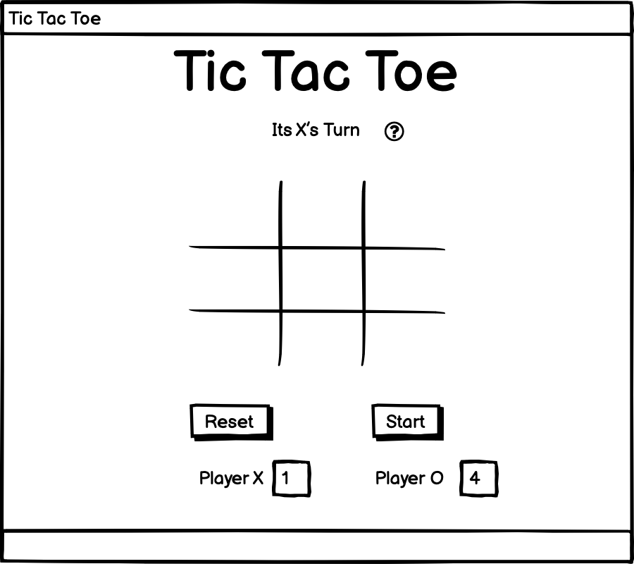

# Tic tac Toe 
I have been struggled alot and this project is not even near done. I need to re- submit it later. 

The live link kan be found here [visit website]( https://kharriitd.github.io/tic_tac_toe/)
## Existing Features 

## Testing 

## Bugs

## Deployment 

* The site was deployed to Github pages. Yhe steps to deploy are as follows: 
  - In the Github respository, navigate to the Settings tab.
  - From the source section drop-down menu, select the Master Branch 
  - Once the master branch has been selected, the page provided the link completed website.

## Credits
### Content
Modul code from - https://www.youtube.com/watch?v=MBaw_6cPmAw&t=3s
### Media 
sources 
https://www.flaticon.com/free-icons/tic-tac-toe